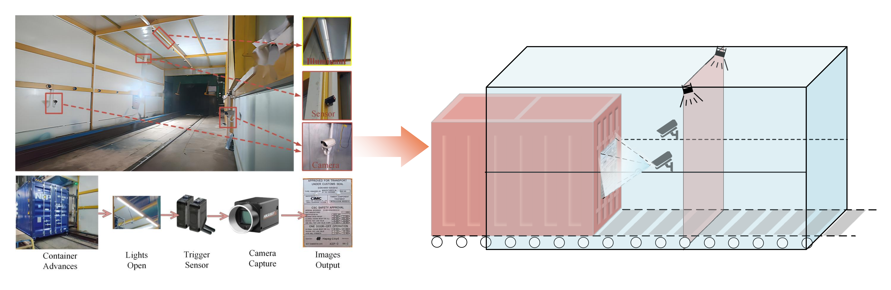
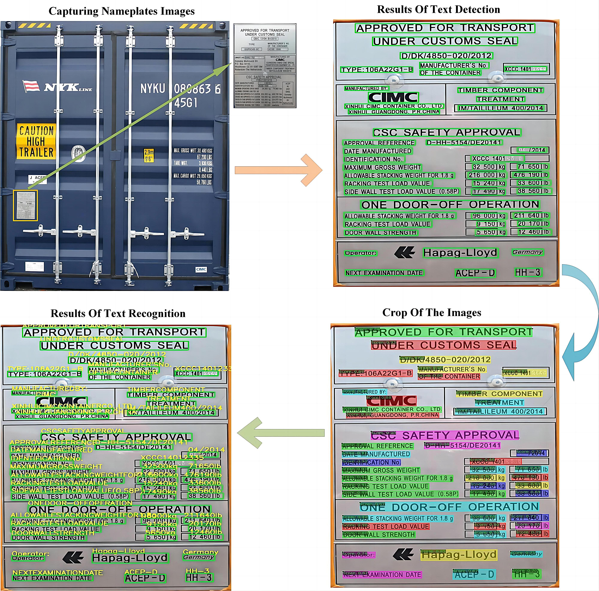

# Container Nameplate Text Recognition: Large-Scale Annotated Dataset and Advanced Detection Network

## Overview

This is the official repository for **“Container Nameplate Text Detection and Recognition Network with A Large-Scale Annotated Dataset”**.

---

## Abstract

The container nameplate includes essential identification information, which is crucial for logistics management. The task of text detection and recognition on nameplates is vital for parsing information on containers, representing a critical step in container management. However, this research field lacks a large-scale annotated dataset of nameplate images. 

To address this issue, we propose a large-scale annotated nameplate dataset for the implementation of container nameplate detection and recognition, called **CNP dataset**. It comprises **84,813 annotated instances** from **2,161 high-definition nameplate images**, obtained through a semi-supervised data annotation method for label acquisition. 

Moreover, to establish an effective benchmark pipeline for this task, we develop a two-stage Text Detection and Recognition Network (**TDRNet**). In the detection stage, TDRNet introduces a point-guided polygon detection design within a transformer-based framework, where uniformly distributed control points are used as polygon query points to improve geometric representation and localization robustness for dense and elongated nameplate text. In the recognition stage, TDRNet employs an existing recognition model as a reliable component of the overall pipeline. 

We further evaluate the dataset using representative scene text detection and recognition methods to provide benchmark results for future research.

---

## Representative Samples of the CNP Dataset

<p align="center">
  
</p>

The dataset includes diverse container nameplate images under real-world industrial conditions, including variations in lighting, reflection, blur, and perspective distortion.

---

## Data Acquisition

<p align="center">
  
</p>

The data acquisition system eliminates factors that interfere with image collection in complex workshop environments, resulting in high-quality image data.

---

## Nameplate Information and TDRNet

<p align="center">
  
</p>

Container nameplates often contain dense, structured, and elongated text regions. These characteristics introduce significant challenges for both detection and recognition tasks. The proposed TDRNet framework enhances the robustness and accuracy of text detection under such challenging conditions.

---

## Dataset Access

To obtain the CNP dataset:

1. Use your institutional email address (edu, stu, etc.).
2. Send an email request to: **yikuizhai@126.com**
3. Sign the required agreement to ensure that the dataset is used only for scientific research and not for commercial purposes.

**Note:**  
If you use this dataset as a benchmark dataset for your research, please cite the corresponding paper in `eula.pdf`.

**Baidu Link:**  
https://pan.baidu.com/s/1fLJAx607ETxGezIZX1hTMg  

(Access will be granted after the paper is accepted.)

---

## Dataset Preparation

The dataset is organized as follows:

```text
data/
├── train_data/
├── train_rec_data/
├── val_data/
├── val_rec_data/
└── annotations/
    ├── train_data.txt
    ├── val_data.txt
    ├── train_rec_gt.txt
    └── val_rec_gt.txt
